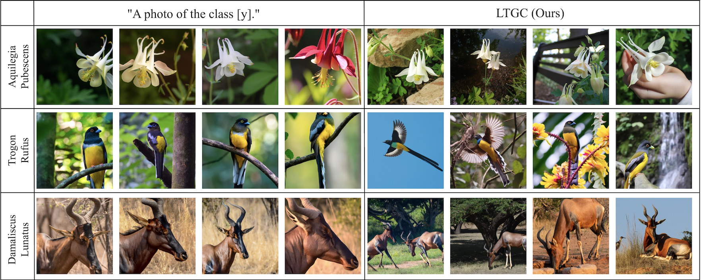

# LTGC: Long-Tail Recognition via Leveraging Generated Content [Official, CVPR 2024, Oral]
[[Project]](https://github.com/ltgccode/LTGC-Long-Tail-Recognition-via-Leveraging-Generated-Content) [[Paper]](https://arxiv.org/pdf/2403.05854.pdf)

## Overview
[Qihao Zhao](https://scholar.google.com/citations?hl=zh-CN&user=sECb19EAAAAJ)<sup>\*</sup>,&nbsp; [Yalun Dai](https://github.com/dialogueeeeee)<sup>\*</sup>,&nbsp; [Hao Li](https://scholar.google.com/citations?user=4dokjDoAAAAJ),&nbsp; [Wei Hu](https://scholar.google.com/citations?user=ACJickwAAAAJ),&nbsp; [Fan Zhang](https://scholar.google.com/citations?user=CujOi1kAAAAJ),&nbsp; [Jun Liu](https://scholar.google.com/citations?user=Q5Ild8UAAAAJ),&nbsp; 

(BUCT & NTU & SUTD & NWPU, \* Equal contribution)

IEEE Conference on Computer Vision and Pattern Recognition (CVPR) 2024, **Oral Presentation**



Further information please contact [Qihao Zhao](https://fistyee.github.io/) and [Yalun Dai](https://github.com/dialogueeeeee).

## Dataset Preparation

### (1) Three bechmark datasets
- Please download these datasets and put them to the /data file.
- ImageNet-LT and Places-LT can be found at [here](https://drive.google.com/drive/u/0/folders/1j7Nkfe6ZhzKFXePHdsseeeGI877Xu1yf).
- iNaturalist data should be the 2018 version from [here](https://github.com/visipedia/inat_comp).

```
data
├── ImageNet_LT
│   ├── test
│   ├── train
│   └── val
├── Place365
│   ├── data_256
│   ├── test_256
│   └── val_256
└── iNaturalist 
    ├── test2018
    └── train_val2018
```

### (2) Txt files
```
data_txt
├── ImageNet_LT
│   ├── ImageNet_LT_test.txt
│   ├── ImageNet_LT_train.txt
│   └── ImageNet_LT_val.txt
├── Places_LT_v2
│   ├── Places_LT_test.txt
│   ├── Places_LT_train.txt
│   └── Places_LT_val.txt
└── iNaturalist18
    ├── iNaturalist18_train.txt
    ├── iNaturalist18_uniform.txt
    └── iNaturalist18_val.txt 
```

## Running Scripts
Before running, please replace your own **OPENAI key**.

### Generated Existing Tail-class Descriptions
``` bash
python lmm_i2t.py -d $DATASET_PATH -m $MAX_NUMBER -f $CLASS_NUMBER_FILE -exi $EXIST_DESCRIPTION_FILE
```

### Generated Extended Tail-class Descriptions 
``` bash
python lmm_extension.py -exi $EXIST_DESCRIPTION_FILE -m $MAX_GENERATED_IMAGES -ext $EXTEND_DESCRIPTION_FILE
```

### Generated Extended Data using Iterative Evaluation
``` bash
python draw_i2t.py -ext $EXTEND_DESCRIPTION_FILE -d $DATASET_PATH -t $THRESH -r $MAX_ROUNDS
```
